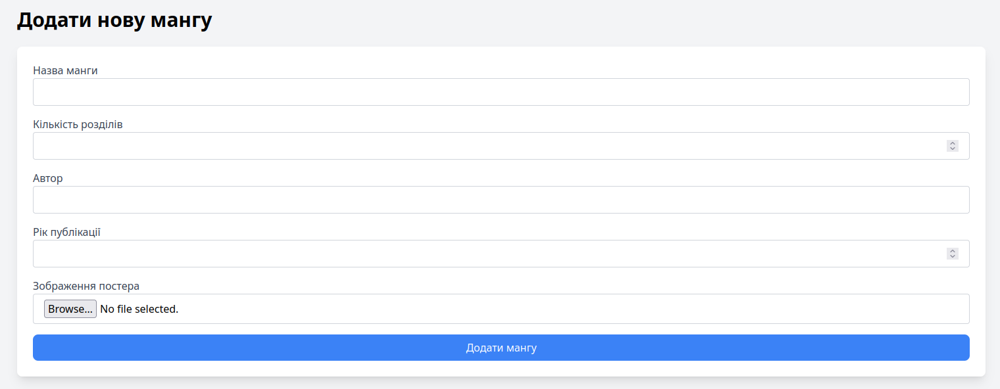
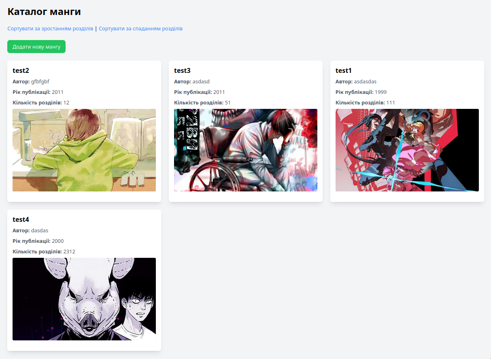

# 📚 Manga Catalog — PHP Web App

Це проста веб-аплікація на PHP для додавання та перегляду манґи. Поточна версія підтримує додавання нових записів та перегляд каталогу манґи у табличному вигляді.

---

## 📁 Структура проєкту

```
.
├── config/                # Налаштування (база даних)
│   └── db_config.php
├── css/                   # Вихідний файл стилів Tailwind
│   └── tailwind.css
├── docx/                  # Документація або мокапи
│   ├── page1.png
│   └── page2.png
├── public/                # Головні сторінки сайту
│   ├── add_manga.html     # HTML-форма для додавання манґи
│   ├── add_manga.php      # PHP-обробка форми
│   ├── catalog.php        # Сторінка каталогу
│   └── style.css          # Скомпільовані стилі (Tailwind)
├── uploads/               # Завантажені зображення
│   └── *.jpg
├── tailwind.config.js     # Конфігурація Tailwind CSS
├── package.json
├── package-lock.json
└── README.md              # Документація проєкту
```

---

## ⚙️ Встановлення

1. Клонуйте репозиторій:
   ```bash
   git clone https://github.com/Hanashiko/manga-catalog.git
   cd manga-catalog
   ```

2. **Налаштуйте базу даних:**

   Використайте наступний SQL-запит для створення таблиці:

   ```sql
   CREATE DATABASE manga_catalog CHARACTER SET utf8mb4 COLLATE utf8mb4_unicode_ci;

   USE manga_catalog;

   CREATE TABLE manga (
       id INT AUTO_INCREMENT PRIMARY KEY,
       title VARCHAR(255) NOT NULL,
       description TEXT,
       cover_image VARCHAR(255),
       created_at TIMESTAMP DEFAULT CURRENT_TIMESTAMP
   );
   ```

3. **Налаштування `config/db_config.php`:**

   ```php
   <?php
   define('DB_SERVER', 'localhost');
   define('DB_USERNAME', 'php');
   define('DB_PASSWORD', 'mAp101HG');
   define('DB_DATABASE', 'manga_catalog');

   $conn = new mysqli(DB_SERVER, DB_USERNAME, DB_PASSWORD, DB_DATABASE);

   if ($conn->connect_error) {
       die("Connection failed: " . $conn->connect_error);
   }
   ?>
   ```

4. **Скомпілюйте Tailwind CSS:**

   Встановіть залежності:

   ```bash
   npm install
   ```

   Запустіть компіляцію стилів:

   ```bash
   npx tailwindcss -i ./css/tailwind.css -o ./public/style.css --watch
   ```

5. **Запустіть локальний сервер:**

   ```bash
   php -S localhost:8000 -t public
   ```

---

## 🛠️ Функціонал

- ✅ Додавання манґи з обкладинкою
- ✅ Перегляд каталогу всіх манґ
- 🚧 Детальний перегляд — *в розробці*
- 🚧 Редагування/видалення записів — *в розробці*

---

## 🖼️ Інтерфейс

Приклади вигляду сторінок — у `docx/page1.png` і `docx/page2.png`.

---

## 📌 Технічні деталі

- Підключення до MySQL здійснюється через `mysqli`.
- Завантажені зображення зберігаються в `uploads/`.
- Стилі створюються за допомогою **Tailwind CSS**.
- Зображення з форми завантажуються та зберігаються із унікальними іменами.

---

## 🔮 Подальші плани

- [ ] Додати сторінку детального перегляду манґи
- [ ] Додати можливість редагування запису
- [ ] Видалення манґи з каталогу
- [ ] Валідація форм (як на клієнтській, так і серверній стороні)
- [ ] Покращення UI/UX

---

## 📷 Приклад виконання

### 📝 Сторінка з додаванням контенту


### 📖 Сторінка з переглядом наявного контенту

